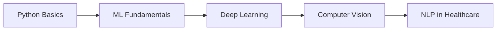
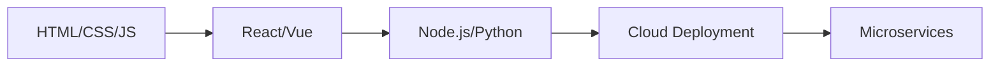

# 👋 Hi, I'm Shazim Javed!

---

## 🚀 About Me

I'm a passionate **Full Stack Developer** and **AI Enthusiast** specializing in **Healthcare Technology** and **Machine Learning**. I love building innovative solutions that make a real impact on people's lives, especially in the medical field.

- 🔭 Currently working on **Advanced Healthcare AI Systems**
- 🌱 Learning **Deep Learning** and **Computer Vision**
- 👯 Looking to collaborate on **Healthcare Tech Projects**
- 💬 Ask me about **Python, Machine Learning, Web Development**
- ⚡ Fun fact: I build AI systems that can save lives! 🏥

---

## 🛠️ Tech Stack

### 💻 Programming Languages

### 🤖 AI & Machine Learning

### 🌐 Web Development

### 🗄️ Databases

### ☁️ Cloud & DevOps

---

## 📊 GitHub Analytics

  
  

  

---

## 🏆 GitHub Trophies

  

---

## 🌟 Featured Projects

### 🏥 [Advanced Cardiovascular System](https://github.com/shazimjaved/Advanced-cardiovascular-system)

> 🤖 **AI-Powered Healthcare System** with 92%+ accuracy for heart disease prediction
> 
> 🎯 **Features**: Multi-model ML, Real-time Analytics, HIPAA Compliance, AI Consultation

### 🚀 [Coming Soon - More Projects]
> 📱 **Mobile Health Apps** | 🧠 **Neural Network Research** | ☁️ **Cloud Healthcare Solutions**

---

## 📈 Activity Graph

  

---

## 🤝 Connect With Me

---

## 📝 Latest Blog Posts

<!-- BLOG-POST-LIST:START -->
- 🚀 [Building AI-Powered Healthcare Systems](https://medium.com/@shazimjaved)
- 🧠 [Machine Learning in Medical Diagnosis](https://medium.com/@shazimjaved)
- 💻 [Full Stack Development Best Practices](https://medium.com/@shazimjaved)
<!-- BLOG-POST-LIST:END -->

---

## 🎯 Current Goals

- [ ] 🏥 **Launch 5 Healthcare AI Projects**
- [ ] 🤖 **Contribute to Open Source Medical AI**
- [ ] 📚 **Publish Research Papers on ML in Healthcare**
- [ ] 🌍 **Build Global Health Tech Community**
- [ ] 🚀 **Start Healthcare Tech Startup**

---

## 📚 Learning Roadmap

### 🧠 **AI/ML Path**

### 🌐 **Web Dev Path**

---

## 🎵 Spotify Playing (When Coding)

  

---

## 🙏 Visitor Count

  

---

## 💭 Quote of the Day

  

---

**🌟 "Code is poetry, AI is magic, Healthcare is purpose"**

**⭐ Star this repo if it helped you!**

