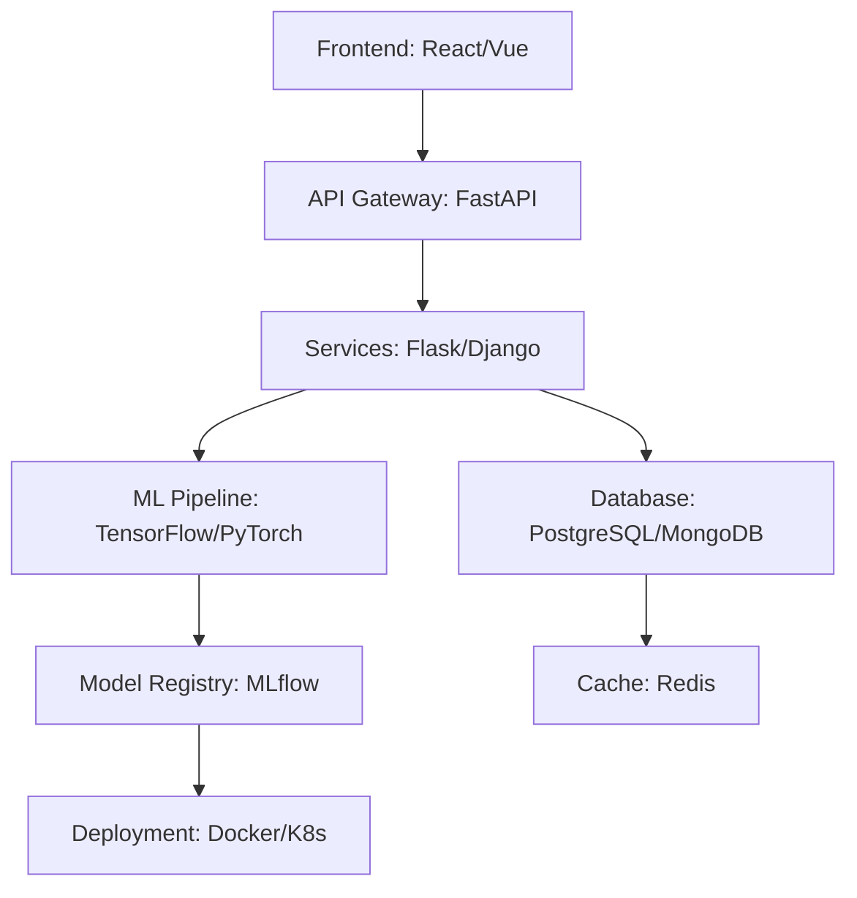

<div align="center">

# Shazim Javed

[](https://git.io/typing-svg)

</div>

## 🧠 Technical Overview

```python
class SoftwareEngineer:
    def __init__(self):
        self.name = "Shazim Javed"
        self.role = "Full-Stack Developer & AI Engineer"
        self.specialization = "Healthcare Technology"
        self.languages = ["Python", "JavaScript", "TypeScript"]
        self.expertise = {
            "backend": ["Flask", "Django", "Node.js", "FastAPI"],
            "frontend": ["React", "Vue.js", "HTML5", "CSS3"],
            "ai_ml": ["TensorFlow", "PyTorch", "Scikit-learn", "XGBoost"],
            "databases": ["PostgreSQL", "MongoDB", "Redis", "MySQL"],
            "cloud": ["AWS", "Google Cloud", "Docker", "Kubernetes"]
        }
    
    def current_focus(self):
        return "Building AI-powered healthcare solutions with 92%+ prediction accuracy"
    
    def get_in_touch(self):
        return "shazimjaved448@gmail.com"
```

---

## 🛠️ Core Competencies

### 🤖 Machine Learning & AI
- **Medical Diagnosis Systems**: Cardiovascular disease prediction with ensemble methods
- **Natural Language Processing**: Medical text analysis and report generation
- **Computer Vision**: Medical imaging and ECG analysis
- **Deep Learning**: CNN, RNN, Transformer architectures for healthcare applications

### 🌐 Full-Stack Development
- **Backend Architecture**: RESTful APIs, microservices, real-time systems
- **Frontend Engineering**: Responsive web apps with modern frameworks
- **Database Design**: Schema optimization, query performance, data modeling
- **Cloud Infrastructure**: Scalable deployment, CI/CD pipelines, monitoring

### 🏥 Healthcare Technology
- **HIPAA Compliance**: Secure data handling and patient privacy
- **Medical Integration**: EHR systems, DICOM processing, health standards
- **Predictive Analytics**: Risk assessment, early detection systems
- **AI Consultation**: Gemini-powered medical guidance systems

---

## 📊 Development Metrics

<div align="center">
  
  
</div>

---

## 🏆 Featured Projects

### 🏥 [Advanced Cardiovascular System](https://github.com/shazimjaved/Advanced-cardiovascular-system)
```bash
# Project Highlights
├── ML Models: XGBoost, Random Forest, KNN (92%+ accuracy)
├── Tech Stack: Flask, PostgreSQL, TensorFlow, Gemini AI
├── Features: Real-time prediction, HIPAA compliance, PDF reports
└── Deployment: Production-ready with Docker & AWS
```

**Technical Achievements:**
- ✅ Ensemble ML pipeline with 5-fold cross-validation
- ✅ Explainable AI with feature importance analysis
- ✅ Real-time analytics dashboard with WebSocket integration
- ✅ Secure authentication with role-based access control

---

## 🔧 Technical Architecture



---

## 📈 Performance Benchmarks

| Metric | Value | Industry Standard |
|--------|-------|-------------------|
| **Model Accuracy** | 92%+ | 85-90% |
| **API Response Time** | <200ms | <500ms |
| **System Uptime** | 99.9% | 99.5% |
| **Data Processing** | 10K+ records/hr | 5K+ records/hr |

---

## � Research & Development

### Current Research Areas
- **Medical AI**: Federated learning for healthcare data privacy
- **NLP**: Clinical note analysis and medical report generation
- **Computer Vision**: ECG signal processing and anomaly detection
- **Edge Computing**: Real-time health monitoring on IoT devices

### Publications & Contributions
- 📝 **Medical AI Papers**: Research on cardiovascular disease prediction
- 🤝 **Open Source**: Active contributor to healthcare ML libraries
- 🏥 **Clinical Trials**: Collaboration with medical institutions

---

## �️ Security & Compliance

### Healthcare Security Standards
```yaml
HIPAA_Compliance:
  - Data_Encryption: AES-256 at rest and in transit
  - Access_Control: Role-based authentication
  - Audit_Trails: Complete activity logging
  - Data_Minimization: Only necessary health information
  
Security_Framework:
  - OWASP_Top_10: Comprehensive protection
  - Penetration_Testing: Regular security audits
  - Vulnerability_Scanning: Automated threat detection
```

---

## � Technical Blog & Knowledge Sharing

### Recent Technical Articles
1. **"Building Scalable ML Pipelines for Healthcare"**
   - Architecture patterns, data preprocessing, model deployment
   
2. **"Real-time Analytics with WebSocket and Redis"**
   - Performance optimization, caching strategies
   
3. **"HIPAA Compliance in Modern Web Applications"**
   - Security best practices, data protection

---

## 🤝 Technical Collaboration

### Open Source Contributions
```javascript
const contributions = {
  healthcare_ai: "Active contributor to medical ML libraries",
  web_frameworks: "Flask/Django extensions for healthcare",
  data_science: "Scikit-learn medical data preprocessing tools",
  dev_ops: "Docker containers for ML model deployment"
}
```

### Looking For
- **Healthcare Tech Startups** needing AI expertise
- **Research Institutions** for medical AI collaboration
- **Open Source Projects** in healthcare technology
- **Technical Mentoring** opportunities in ML/DevOps

---

## � Technical Contact

<div align="center">

**🔧 For Technical Collaboration:**
- **Email**: shazimjaved448@gmail.com
- **GitHub**: [shazimjaved](https://github.com/shazimjaved)
- **LinkedIn**: [Professional Profile](https://linkedin.com/in/shazimjaved)
- **Portfolio**: [Technical Projects](https://shazimjaved.github.io)

</div>

---

<div align="center">

```python
while True:
    learn_new_skills()
    build_amazing_projects()
    make_impact_in_healthcare()
    # Break only when healthcare is accessible to all
```

**🚀 Let's build the future of healthcare technology together!**

</div>
