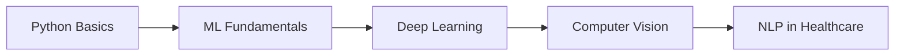
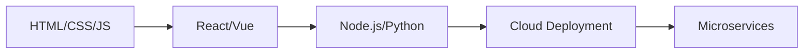

<div align="center">

# Shazim Javed

[](https://git.io/typing-svg)

</div>

## 🧠 Technical Overview

```python
class SoftwareEngineer:
    def __init__(self):
        self.name = "Shazim Javed"
        self.role = "Full-Stack Developer & AI Engineer"
        self.specialization = "Healthcare Technology"
        self.languages = ["Python", "JavaScript", "TypeScript"]
        self.expertise = {
            "backend": ["Flask", "Django", "Node.js", "FastAPI"],
            "frontend": ["React", "Vue.js", "HTML5", "CSS3"],
            "ai_ml": ["TensorFlow", "PyTorch", "Scikit-learn", "XGBoost"],
            "databases": ["PostgreSQL", "MongoDB", "Redis", "MySQL"],
            "cloud": ["AWS", "Google Cloud", "Docker", "Kubernetes"]
        }
    
    def current_focus(self):
        return "Building AI-powered healthcare solutions with 92%+ prediction accuracy"
    
    def get_in_touch(self):
        return "shazimjaved448@gmail.com"
```

---

## 🛠️ Core Competencies

### 🤖 Machine Learning & AI
- **Medical Diagnosis Systems**: Cardiovascular disease prediction with ensemble methods
- **Natural Language Processing**: Medical text analysis and report generation
- **Computer Vision**: Medical imaging and ECG analysis
- **Deep Learning**: CNN, RNN, Transformer architectures for healthcare applications

### 🌐 Full-Stack Development
- **Backend Architecture**: RESTful APIs, microservices, real-time systems
- **Frontend Engineering**: Responsive web apps with modern frameworks
- **Database Design**: Schema optimization, query performance, data modeling
- **Cloud Infrastructure**: Scalable deployment, CI/CD pipelines, monitoring

### 🏥 Healthcare Technology
- **HIPAA Compliance**: Secure data handling and patient privacy
- **Medical Integration**: EHR systems, DICOM processing, health standards
- **Predictive Analytics**: Risk assessment, early detection systems
- **AI Consultation**: Gemini-powered medical guidance systems

---

## 📊 GitHub Analytics

<div align="center">
  
  
</div>

<div align="center">
  
</div>

---

## 🏆 GitHub Trophies

<div align="center">
  
</div>

---

## 🌟 Featured Projects

### 🏥 [Advanced Cardiovascular System](https://github.com/shazimjaved/Advanced-cardiovascular-system)
[](https://github.com/shazimjaved/Advanced-cardiovascular-system)
[](https://github.com/shazimjaved/Advanced-cardiovascular-system)

> 🤖 **AI-Powered Healthcare System** with 92%+ accuracy for heart disease prediction
> 
> 🎯 **Features**: Multi-model ML, Real-time Analytics, HIPAA Compliance, AI Consultation

### 🚀 [Coming Soon - More Projects]
> 📱 **Mobile Health Apps** | 🧠 **Neural Network Research** | ☁️ **Cloud Healthcare Solutions**

---

## 📈 Activity Graph

<div align="center">
  
</div>

---

## 🤝 Connect With Me

<div align="center">

[](https://linkedin.com/in/shazimjaved)
[](https://twitter.com/shazimjaved)
[](mailto:shazimjaved448@gmail.com)
[](https://shazimjaved.github.io)

</div>

---

## 📝 Latest Blog Posts

<!-- BLOG-POST-LIST:START -->
- 🚀 [Building AI-Powered Healthcare Systems](https://medium.com/@shazimjaved)
- 🧠 [Machine Learning in Medical Diagnosis](https://medium.com/@shazimjaved)
- 💻 [Full Stack Development Best Practices](https://medium.com/@shazimjaved)
<!-- BLOG-POST-LIST:END -->

---

## 🎯 Current Goals

- [ ] 🏥 **Launch 5 Healthcare AI Projects**
- [ ] 🤖 **Contribute to Open Source Medical AI**
- [ ] 📚 **Publish Research Papers on ML in Healthcare**
- [ ] 🌍 **Build Global Health Tech Community**
- [ ] 🚀 **Start Healthcare Tech Startup**

---

## 📚 Learning Roadmap

<div align="center">

### 🧠 **AI/ML Path**


### 🌐 **Web Dev Path**


</div>

---

## 🎵 Spotify Playing (When Coding)

<div align="center">
  
</div>

---

## 🙏 Visitor Count

<div align="center">
  
</div>

---

## 💭 Quote of the Day

<div align="center">
  
</div>

---

<div align="center">

**🌟 "Code is poetry, AI is magic, Healthcare is purpose"**


**⭐ Star this repo if it helped you!**

</div>
